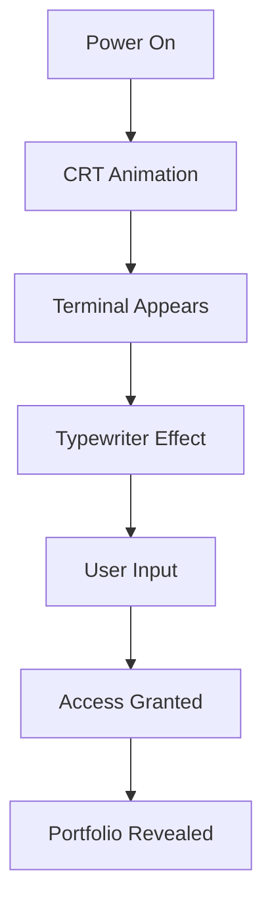

# IGF-OS Portfolio - README Completo

<div align="center">
  
</div>

---

<details>
<summary>🇪🇸 Español</summary>

### ¿Qué es IGF-OS Portfolio?

**IGF-OS Portfolio** es una aplicación web de una sola página (SPA) construida con React que simula un sistema operativo con estética cyberpunk. Es el portfolio profesional de **Ibai Gallego Faces**, Desarrollador Full-Stack y Especialista en Automatización con IA. [1](#1-0) 

### Características Principales

#### 🚀 Secuencia de Arranque Interactiva
La aplicación comienza con una simulación de encendido de monitor CRT con efectos de scanlines y glitch. Después de 1.5 segundos, aparece un terminal con mensaje de boot animado con efecto typewriter. [2](#1-1) 

#### 💻 Terminal Emulator
Los usuarios pueden interactuar con un terminal funcional que incluye comandos como:
- `help` - Muestra comandos disponibles
- `ls` - Lista archivos virtuales
- `access`/`start` - Accede al portfolio completo
- `clear` - Limpia el historial
- `sudo` - Simula error de permisos [3](#1-2) 

#### 🎨 Secciones del Portfolio
Una vez accedido, el portfolio se divide en:
- **El Núcleo** - Biografía y formación académica
- **Habilidades Técnicas** - Categorizadas por tecnología (Dev, Data, Tools, Design)
- **Experiencia Laboral** - Timeline interactivo
- **Proyectos Personales** - Cards interactivas con demos y repositorios
- **Contacto** - Información de contacto directa [4](#1-3) 

#### 🌍 Sistema de Traducción
La aplicación soporta español e inglés con un botón de cambio de idioma que aplica efectos de glitch durante la transición. [5](#1-4) 

### Instalación y Uso

**Prerrequisitos:** Node.js

1. Instalar dependencias:
   ```bash
   npm install
   ```

2. Configurar API Key:
   - Crear archivo `.env.local`
   - Añadir `GEMINI_API_KEY=tu_api_key`

3. Ejecutar aplicación:
   ```bash
   npm run dev
   ```

4. Abrir en navegador: `http://localhost:5173` [6](#1-5) 

### Tecnologías Utilizadas

| Tecnología | Uso |
|------------|-----|
| React 18+ | Framework principal |
| Vite | Build tool y desarrollo |
| Tailwind CSS | Estilos y diseño |
| TypeScript | Tipado estático |
| Lucide React | Iconos |
| Gemini API | Funcionalidades IA |

</details>

<details>
<summary>🇬🇧 English</summary>

### What is IGF-OS Portfolio?

**IGF-OS Portfolio** is a single-page application (SPA) built with React that simulates an operating system with cyberpunk aesthetics. It's the professional portfolio of **Ibai Gallego Faces**, Full-Stack Developer and AI Automation Specialist. [1](#1-0) 

### Main Features

#### 🚀 Interactive Boot Sequence
The application starts with a CRT monitor power-on simulation featuring scanlines and glitch effects. After 1.5 seconds, a terminal appears with an animated boot message using typewriter effect. [2](#1-1) 

#### 💻 Terminal Emulator
Users can interact with a functional terminal that includes commands like:
- `help` - Shows available commands
- `ls` - Lists virtual files
- `access`/`start` - Accesses full portfolio
- `clear` - Clears history
- `sudo` - Simulates permission error [3](#1-2) 

#### 🎨 Portfolio Sections
Once accessed, the portfolio is divided into:
- **The Core** - Biography and academic background
- **Technical Skills** - Categorized by technology (Dev, Data, Tools, Design)
- **Work Experience** - Interactive timeline
- **Personal Projects** - Interactive cards with demos and repositories
- **Contact** - Direct contact information [4](#1-3) 

#### 🌍 Translation System
The application supports Spanish and English with a language toggle button that applies glitch effects during transition. [5](#1-4) 

### Installation and Usage

**Prerequisites:** Node.js

1. Install dependencies:
   ```bash
   npm install
   ```

2. Configure API Key:
   - Create `.env.local` file
   - Add `GEMINI_API_KEY=your_api_key`

3. Run application:
   ```bash
   npm run dev
   ```

4. Open in browser: `http://localhost:5173` [6](#1-5) 

### Technologies Used

| Technology | Purpose |
|------------|---------|
| React 18+ | Main framework |
| Vite | Build tool and development |
| Tailwind CSS | Styling and design |
| TypeScript | Static typing |
| Lucide React | Icons |
| Gemini API | AI features |

</details>

---

## 📁 Project Structure

```
Portfolio/
├── src/
│   ├── App.tsx          # Main application component
│   ├── main.tsx         # Entry point
│   ├── translations.ts  # Language translations
│   └── index.css        # Global styles and animations
├── public/
│   └── index.html       # HTML template
├── README.md            # This file
├── package.json         # Dependencies and scripts
└── metadata.json        # Project metadata
```

## 🔧 Key Components

### Boot Sequence Flow


### State Management
The application uses React hooks to manage:
- `isPoweringOn` - Controls boot animation
- `hasAccessed` - Gates portfolio content
- `lang` - Language selection ('es' | 'en')
- `terminalHistory` - Terminal command history [7](#1-6) 

## 🎯 Target Audience

This portfolio is designed for:
- Technical recruiters
- Potential employers
- Collaborators in tech projects
- Anyone interested in cyberpunk-themed web experiences

## 📱 Responsive Design

The application is fully responsive with:
- Mobile-optimized navigation
- Touch-friendly interactions
- Adaptive layouts for all screen sizes
- Performance optimizations for mobile devices [8](#1-7) 

---

## Notes
Este README proporciona una descripción completa de la aplicación IGF-OS Portfolio en ambos idiomas. Los desplegables permiten a los lectores elegir entre español e inglés fácilmente. La documentación cubre todas las características principales de la aplicación, incluyendo la secuencia de arranque, el emulador de terminal, las secciones del portfolio y la instalación.

Wiki pages you might want to explore:
- [Overview (ibim4ster/Portfolio)](/wiki/ibim4ster/Portfolio#1)
- [Boot Sequence & Terminal Emulator (ibim4ster/Portfolio)](/wiki/ibim4ster/Portfolio#3.1)

Wiki pages you might want to explore:
- [Overview (ibim4ster/Portfolio)](/wiki/ibim4ster/Portfolio#1)
- [Glossary (ibim4ster/Portfolio)](/wiki/ibim4ster/Portfolio#6)

### Citations

**File:** src/App.tsx (L1-14)
```typescript
/**
 * @license
 * SPDX-License-Identifier: Apache-2.0
 */

import { useState, useEffect, useRef } from 'react';
import { translations, Language } from './translations';
import { Cpu, ShieldCheck, Calculator, Orbit, Fingerprint, ReceiptEuro, Linkedin, Mail, Phone, Code2, Database, Wrench, Palette, Menu, X } from 'lucide-react';
import { FaJava, FaDatabase, FaCashRegister, FaVideo, FaPhotoVideo } from 'react-icons/fa';
import { SiPython, SiPhp, SiHtml5, SiVirtualbox, SiVmware, SiGit, SiAndroidstudio, SiIntellijidea, SiCanva, SiDavinciresolve, SiCss, SiJavascript, SiMongodb, SiVegas, SiSage, SiAgora } from 'react-icons/si';
import { BsFiletypeXml } from 'react-icons/bs';
import { TbChartLine, TbBrandCSharp, TbBrandAdobePremier } from 'react-icons/tb';
import { DiMsqlServer, DiVisualstudio, DiPhotoshop } from 'react-icons/di';

```

**File:** src/App.tsx (L16-28)
```typescript
  const [typedText, setTypedText] = useState("");
  const [flash, setFlash] = useState(false);
  const [hasAccessed, setHasAccessed] = useState(false);
  const [lang, setLang] = useState<Language>('es');
  const [isPoweringOn, setIsPoweringOn] = useState(true);
  const [isMenuOpen, setIsMenuOpen] = useState(false);
  const [isGlitching, setIsGlitching] = useState(false);
  const [isMobile, setIsMobile] = useState(typeof window !== 'undefined' ? window.innerWidth < 1024 : false);
  
  // Terminal state
  const [terminalHistory, setTerminalHistory] = useState<string[]>([]);
  const [terminalInput, setTerminalInput] = useState("");
  const [isTypingComplete, setIsTypingComplete] = useState(false);
```

**File:** src/App.tsx (L35-61)
```typescript
  useEffect(() => {
    const timer = setTimeout(() => setIsPoweringOn(false), 1500);
    
    const handleResize = () => setIsMobile(window.innerWidth < 1024);
    window.addEventListener('resize', handleResize);
    
    return () => {
      clearTimeout(timer);
      window.removeEventListener('resize', handleResize);
    };
  }, []);

  // Typewriter effect
  useEffect(() => {
    let i = 0;
    setTypedText(""); // Reset text when language changes before access
    setIsTypingComplete(false);
    const interval = setInterval(() => {
      setTypedText(fullText.slice(0, i));
      i++;
      if (i > fullText.length) {
        clearInterval(interval);
        setIsTypingComplete(true);
      }
    }, 30);
    return () => clearInterval(interval);
  }, [fullText]);
```

**File:** src/App.tsx (L63-95)
```typescript
  const handleTerminalSubmit = (e: React.KeyboardEvent<HTMLInputElement>) => {
    if (e.key === 'Enter') {
      const cmd = terminalInput.trim().toLowerCase();
      const newHistory = [...terminalHistory, `guest@igf-os:~$ ${terminalInput}`];
      
      if (cmd === 'help') {
        newHistory.push('Available commands: help, ls, whoami, date, clear, sudo, access, start');
      } else if (cmd === 'ls') {
        newHistory.push('about.txt  skills.sh  projects.exe  contact.cfg');
      } else if (cmd === 'whoami') {
        newHistory.push('guest');
      } else if (cmd === 'date') {
        newHistory.push(new Date().toString());
      } else if (cmd === 'clear') {
        setTerminalHistory([]);
        setTerminalInput('');
        return;
      } else if (cmd === 'sudo') {
        newHistory.push('guest is not in the sudoers file. This incident will be reported.');
      } else if (cmd === 'access' || cmd === 'start') {
        newHistory.push('Accessing system...');
        setTerminalHistory(newHistory);
        setTerminalInput('');
        handleAccess();
        return;
      } else if (cmd !== '') {
        newHistory.push(`bash: ${cmd}: command not found`);
      }
      
      setTerminalHistory(newHistory);
      setTerminalInput('');
    }
  };
```

**File:** src/App.tsx (L164-170)
```typescript
  const toggleLanguage = () => {
    setIsGlitching(true);
    setTimeout(() => {
      setLang(prev => prev === 'es' ? 'en' : 'es');
      setTimeout(() => setIsGlitching(false), 300);
    }, 100);
  };
```

**File:** src/App.tsx (L381-597)
```typescript
          {/* 2. SOBRE MÍ / EL NÚCLEO & DATOS ACADÉMICOS */}
          <section id="about" className="min-h-screen p-6 md:p-24 flex flex-col justify-center relative z-10 scroll-mt-20">
            <h2 className="font-sans text-3xl md:text-6xl font-bold text-white mb-12 uppercase glitch-text reveal" data-text={t.core.title}>{t.core.title}</h2>
            
            <div className="clip-cyber border-2 border-[#00FF41] p-8 md:p-12 bg-noise relative reveal delay-100 hover:shadow-[0_0_20px_rgba(0,255,65,0.15)] transition-shadow duration-500">
              <p className="font-sans text-xl md:text-2xl text-gray-200 leading-relaxed mb-12">
                {t.core.bio}
              </p>
              
              <h3 className="font-sans text-2xl md:text-4xl font-bold text-[#00FF41] mb-8 uppercase border-b-2 border-[#00FF41] inline-block pb-2">{t.core.academicTitle}</h3>
              
              <div className="grid grid-cols-1 lg:grid-cols-2 gap-8">
                {/* DAM */}
                <div className="border border-[#00FF41]/50 p-6 bg-black/50 hover:border-[#00FF41] [&.mobile-active]:border-[#00FF41] transition-colors group auto-animate">
                  <div className="text-[#00FF41] font-mono font-bold mb-2">{t.core.dam.date}</div>
                  <h4 className="font-sans text-xl md:text-2xl font-bold text-white mb-2 group-hover:text-[#00FF41] group-[.mobile-active]:text-[#00FF41] transition-colors">{t.core.dam.title}</h4>
                  <p className="font-mono text-sm text-[#BD00FF] mb-6">{t.core.dam.subtitle}</p>
                  <ul className="font-sans text-gray-300 space-y-3 text-sm md:text-base list-disc list-inside">
                    <li>{t.core.dam.p1}</li>
                    <li>{t.core.dam.p2}</li>
                    <li>{t.core.dam.p3}</li>
                    <li>{t.core.dam.p4}</li>
                    <li>{t.core.dam.p5}</li>
                  </ul>
                </div>
                {/* SMR */}
                <div className="border border-[#00FF41]/50 p-6 bg-black/50 hover:border-[#00FF41] [&.mobile-active]:border-[#00FF41] transition-colors group auto-animate">
                  <div className="text-[#00FF41] font-mono font-bold mb-2">{t.core.smr.date}</div>
                  <h4 className="font-sans text-xl md:text-2xl font-bold text-white mb-2 group-hover:text-[#00FF41] group-[.mobile-active]:text-[#00FF41] transition-colors">{t.core.smr.title}</h4>
                  <p className="font-mono text-sm text-[#BD00FF] mb-6">{t.core.smr.subtitle}</p>
                  <ul className="font-sans text-gray-300 space-y-3 text-sm md:text-base list-disc list-inside">
                    <li>{t.core.smr.p1}</li>
                    <li>{t.core.smr.p2}</li>
                    <li>{t.core.smr.p3}</li>
                    <li>{t.core.smr.p4}</li>
                  </ul>
                </div>
              </div>
            </div>
          </section>

          {/* 3. HABILIDADES TÉCNICAS E IA */}
          <section id="skills" className="min-h-screen p-6 md:p-24 flex flex-col justify-center relative z-10 scroll-mt-20">
            <h2 className="font-sans text-3xl md:text-6xl font-bold text-white mb-12 uppercase glitch-text reveal" data-text={t.skills.title}>{t.skills.title}</h2>
            
            <div className="flex flex-col gap-12 mb-20">
              {skillCategories.map((cat, idx) => (
                <div key={cat.id} className={`reveal delay-${(idx + 1) * 100}`}>
                  <h3 className={`font-mono ${cat.color} font-bold text-xl md:text-2xl border-b border-gray-800 pb-3 mb-6 flex items-center gap-3`}>
                    <cat.icon className="w-6 h-6" /> {cat.title}
                  </h3>
                  <div className="flex flex-wrap justify-center md:justify-start gap-4 sm:gap-6">
                    {cat.skills.map((skill, sIdx) => (
                      <div key={sIdx} className={`relative p-[2px] rounded-xl bg-gradient-to-br ${cat.gradient} group hover:scale-105 [&.mobile-active]:scale-105 transition-all duration-300 ${cat.shadowHover} auto-animate`}>
                        <div className="w-24 h-24 sm:w-32 sm:h-32 bg-[#0a0a0a] rounded-xl flex flex-col items-center justify-center gap-2 sm:gap-3">
                          <skill.icon className={`w-10 h-10 sm:w-12 sm:h-12 ${cat.color} group-hover:scale-110 group-[.mobile-active]:scale-110 transition-transform duration-300`} />
                          <span className="text-[10px] sm:text-xs font-mono text-gray-300 font-bold tracking-wider">{skill.name}</span>
                        </div>
                      </div>
                    ))}
                  </div>
                </div>
              ))}
            </div>

            {/* INTELIGENCIA ARTIFICIAL */}
            <div className="border-2 border-[#BD00FF] p-8 md:p-12 bg-[#BD00FF]/5 relative reveal delay-500 hover:shadow-[0_0_20px_rgba(189,0,255,0.2)] transition-shadow">
              <div className="absolute -top-5 left-8 bg-[#050505] px-4 text-[#BD00FF] font-mono font-bold text-xl md:text-2xl">
                {t.skills.ai.title}
              </div>
              <div className="grid grid-cols-1 md:grid-cols-2 gap-8 mt-6">
                <div className="space-y-6">
                  {t.skills.ai.items.slice(0, 3).map((item, idx) => (
                    <div key={idx}>
                      <h4 className="text-white font-sans font-bold text-lg mb-1">{item.title}</h4>
                      <p className="text-gray-300 font-sans text-sm md:text-base">{item.desc}</p>
                    </div>
                  ))}
                </div>
                <div className="space-y-6">
                  {t.skills.ai.items.slice(3, 6).map((item, idx) => (
                    <div key={idx}>
                      <h4 className="text-white font-sans font-bold text-lg mb-1">{item.title}</h4>
                      <p className="text-gray-300 font-sans text-sm md:text-base">{item.desc}</p>
                    </div>
                  ))}
                </div>
              </div>
            </div>
          </section>

          {/* 4. EXPERIENCIA LABORAL */}
          <section id="experience" className="min-h-screen p-6 md:p-24 flex flex-col justify-center relative z-10 scroll-mt-20">
            <h2 className="font-sans text-3xl md:text-6xl font-bold text-white mb-12 uppercase glitch-text reveal" data-text={t.experience.title}>{t.experience.title}</h2>
            
            <div className="relative pl-8 border-l-2 border-[#00FF41] space-y-12 font-sans">
              {/* Timeline data load effect */}
              <div className="absolute left-[-10px] top-0 bottom-0 w-4 overflow-hidden text-[10px] text-[#00FF41]/30 leading-none break-all font-mono" aria-hidden="true">
                {Array.from({length: 200}).map(() => "01001011010100101010100101010").join("")}
              </div>

              {t.experience.jobs.map((job, idx) => (
                <div key={idx} className="relative reveal bg-black/40 p-6 md:p-8 border border-[#00FF41]/30 hover:border-[#00FF41] [&.mobile-active]:border-[#00FF41] hover:shadow-[0_0_15px_rgba(0,255,65,0.15)] [&.mobile-active]:shadow-[0_0_15px_rgba(0,255,65,0.15)] transition-all group auto-animate">
                  <div className="absolute -left-[41px] top-8 w-4 h-4 bg-[#00FF41] group-hover:scale-150 group-[.mobile-active]:scale-150 transition-transform"></div>
                  <div className="text-[#00FF41] font-mono font-bold mb-2">{job.date}</div>
                  <h3 className="text-white text-2xl md:text-3xl font-bold mb-2">{job.title}</h3>
                  <ul className="text-gray-300 space-y-2 mt-4 list-disc list-inside text-sm md:text-base">
                    {job.points.map((point, pIdx) => (
                      <li key={pIdx}>{point}</li>
                    ))}
                  </ul>
                </div>
              ))}
            </div>
          </section>

          {/* 5. PROYECTOS PERSONALES */}
          <section id="projects" className="min-h-screen p-6 md:p-24 flex flex-col justify-center relative z-10 cosmic-bg scroll-mt-20">
            <h2 className="font-sans text-3xl md:text-6xl font-bold text-white mb-12 uppercase glitch-text reveal relative z-10" data-text={t.projects.title}>{t.projects.title}</h2>
            
            <div className="grid grid-cols-1 lg:grid-cols-3 gap-8 relative z-10">
              {/* Project 1 */}
              <div className="balatro-card flex flex-col group reveal delay-100 auto-animate">
                <div className="balatro-banner">TFG-GRAVITY</div>
                <div className="balatro-illustration">
                  <div className="absolute inset-0 bg-cyber-grid opacity-50"></div>
                  <Orbit className="w-24 h-24 text-[#00FF41] relative z-10 group-hover:scale-110 group-[.mobile-active]:scale-110 group-hover:rotate-180 group-[.mobile-active]:rotate-180 transition-all duration-700" strokeWidth={1.5} />
                </div>
                <div className="balatro-content">
                  <p className="text-gray-300 font-sans text-sm md:text-base mb-6 flex-grow">{t.projects.items[0].desc}</p>
                  <div className="flex flex-col gap-3 mt-auto">
                    <a href="https://github.com/ibim4ster/TFG-GRAVITY" target="_blank" rel="noreferrer" className="balatro-btn text-[#BD00FF] hover:text-white hover:bg-[#BD00FF] [&.mobile-active]:text-white [&.mobile-active]:bg-[#BD00FF] font-mono font-bold block border border-[#BD00FF] px-4 py-2 text-center transition-colors">
                      {t.projects.repo}
                    </a>
                    <a href="https://drive.google.com/file/d/1FBqu_wv533xr_tcU2T_OpdA-1tcfONmE/view?usp=sharing" target="_blank" rel="noreferrer" className="balatro-btn text-[#00FF41] hover:text-[#050505] hover:bg-[#00FF41] [&.mobile-active]:text-[#050505] [&.mobile-active]:bg-[#00FF41] font-mono font-bold block border border-[#00FF41] px-4 py-2 text-center transition-colors">
                      {t.projects.doc}
                    </a>
                  </div>
                </div>
              </div>
              
              {/* Project 2 */}
              <div className="balatro-card violet-theme flex flex-col group reveal delay-200 auto-animate">
                <div className="balatro-banner violet-theme">GATE PASS</div>
                <div className="balatro-illustration violet-theme">
                  <div className="absolute inset-0 bg-cyber-grid-violet opacity-50"></div>
                  <Fingerprint className="w-24 h-24 text-[#BD00FF] relative z-10 group-hover:scale-110 group-[.mobile-active]:scale-110 transition-transform duration-500" strokeWidth={1.5} />
                </div>
                <div className="balatro-content">
                  <p className="text-gray-300 font-sans text-sm md:text-base mb-4 flex-grow">{t.projects.items[1].desc}</p>
                  
                  <div className="mb-6 p-3 border border-[#BD00FF] bg-[#BD00FF]/10 text-[#BD00FF] text-xs font-mono shadow-[inset_0_0_10px_rgba(189,0,255,0.2)]">
                    <span className="text-white font-bold">CREDENTIALS_</span><br/>
                    &gt; {t.projects.credentials.user}: admin<br/>
                    &gt; {t.projects.credentials.pass}: admin123
                  </div>

                  <div className="flex flex-col gap-3 mt-auto">
                    <a href="https://github.com/ibim4ster/gravity-gate-pass" target="_blank" rel="noreferrer" className="balatro-btn text-[#BD00FF] hover:text-white hover:bg-[#BD00FF] [&.mobile-active]:text-white [&.mobile-active]:bg-[#BD00FF] font-mono font-bold block border border-[#BD00FF] px-4 py-2 text-center transition-colors">
                      {t.projects.repo}
                    </a>
                    <a href="https://gravity-gate-pass.lovable.app/" target="_blank" rel="noreferrer" className="balatro-btn text-[#00FF41] hover:text-[#050505] hover:bg-[#00FF41] [&.mobile-active]:text-[#050505] [&.mobile-active]:bg-[#00FF41] font-mono font-bold block border border-[#00FF41] px-4 py-2 text-center transition-colors">
                      {t.projects.demo}
                    </a>
                  </div>
                </div>
              </div>
              
              {/* Project 3 */}
              <div className="balatro-card flex flex-col group reveal delay-300 auto-animate">
                <div className="balatro-banner">PRESUPUESTOS</div>
                <div className="balatro-illustration">
                  <div className="absolute inset-0 bg-cyber-grid opacity-50"></div>
                  <ReceiptEuro className="w-24 h-24 text-[#00FF41] relative z-10 group-hover:scale-110 group-[.mobile-active]:scale-110 transition-transform duration-500" strokeWidth={1.5} />
                </div>
                <div className="balatro-content">
                  <p className="text-gray-300 font-sans text-sm md:text-base mb-4 flex-grow">{t.projects.items[2].desc}</p>
                  
                  <div className="mb-6 p-3 border border-[#00FF41] bg-[#00FF41]/10 text-[#00FF41] text-xs font-mono shadow-[inset_0_0_10px_rgba(0,255,65,0.2)]">
                    <span className="text-white font-bold">CREDENTIALS_</span><br/>
                    &gt; {t.projects.credentials.user}: admin<br/>
                    &gt; {t.projects.credentials.pass}: admin
                  </div>

                  <div className="flex flex-col gap-3 mt-auto">
                    <a href="https://github.com/ibim4ster/PRESUPUESTOS-" target="_blank" rel="noreferrer" className="balatro-btn text-[#BD00FF] hover:text-white hover:bg-[#BD00FF] [&.mobile-active]:text-white [&.mobile-active]:bg-[#BD00FF] font-mono font-bold block border border-[#BD00FF] px-4 py-2 text-center transition-colors">
                      {t.projects.repo}
                    </a>
                    <a href="https://presupuestos-tau.vercel.app/" target="_blank" rel="noreferrer" className="balatro-btn text-[#00FF41] hover:text-[#050505] hover:bg-[#00FF41] [&.mobile-active]:text-[#050505] [&.mobile-active]:bg-[#00FF41] font-mono font-bold block border border-[#00FF41] px-4 py-2 text-center transition-colors">
                      {t.projects.demo}
                    </a>
                  </div>
                </div>
              </div>
            </div>
          </section>

          {/* 6. CONTACTO / LA LÍNEA DIRECTA */}
          <footer className="border-t-2 border-[#00FF41] bg-[#050505] p-6 font-mono text-sm md:text-base flex flex-col md:flex-row justify-between items-center gap-6 relative z-10 reveal">
            <div className="text-[#00FF41] font-bold">
              <span className="animate-pulse mr-2">█</span> {t.footer.status}
            </div>
            <div className="flex flex-col md:flex-row gap-4 md:gap-8 text-center md:text-left">
              <a href="https://es.linkedin.com/in/ibai-gallego-faces-78623419a" target="_blank" rel="noreferrer" className="text-[#00A0DC] hover:text-white transition-colors flex items-center justify-center md:justify-start gap-2">
                <Linkedin className="w-5 h-5" /> LINKEDIN
              </a>
              <a href="mailto:ibairakelmario@gmail.com" className="text-white hover:text-[#BD00FF] transition-colors flex items-center justify-center md:justify-start gap-2">
                <Mail className="w-5 h-5" /> ibairakelmario@gmail.com
              </a>
              <a href="tel:+34673350491" className="text-white hover:text-[#BD00FF] transition-colors flex items-center justify-center md:justify-start gap-2">
                <Phone className="w-5 h-5" /> +34 673 350 491
              </a>
              <span className="text-[#00FF41] flex items-center justify-center md:justify-start">
                {t.footer.loc}
              </span>
            </div>
          </footer>
```

**File:** README.md (L13-20)
```markdown
**Prerequisites:**  Node.js


1. Install dependencies:
   `npm install`
2. Set the `GEMINI_API_KEY` in [.env.local](.env.local) to your Gemini API key
3. Run the app:
   `npm run dev`
```
