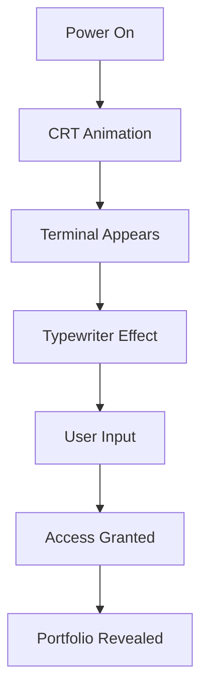

# IGF-OS Portfolio - README Completo

---

<details>
<summary>🇪🇸 Español</summary>

### ¿Qué es IGF-OS Portfolio?

**IGF-OS Portfolio** es una aplicación web de una sola página (SPA) construida con React que simula un sistema operativo con estética cyberpunk. Es el portfolio profesional de **Ibai Gallego Faces**, Desarrollador Full-Stack y Especialista en Automatización con IA.

### Características Principales

#### 🚀 Secuencia de Arranque Interactiva
La aplicación comienza con una simulación de encendido de monitor CRT con efectos de scanlines y glitch. Después de 1.5 segundos, aparece un terminal con mensaje de boot animado con efecto typewriter.

#### 💻 Terminal Emulator
Los usuarios pueden interactuar con un terminal funcional que incluye comandos como:
- `help` - Muestra comandos disponibles
- `ls` - Lista archivos virtuales
- `access`/`start` - Accede al portfolio completo
- `clear` - Limpia el historial
- `sudo` - Simula error de permisos

#### 🎨 Secciones del Portfolio
Una vez accedido, el portfolio se divide en:
- **El Núcleo** - Biografía y formación académica
- **Habilidades Técnicas** - Categorizadas por tecnología (Dev, Data, Tools, Design)
- **Experiencia Laboral** - Timeline interactivo
- **Proyectos Personales** - Cards interactivas con demos y repositorios
- **Contacto** - Información de contacto directa

#### 🌍 Sistema de Traducción
La aplicación soporta español e inglés con un botón de cambio de idioma que aplica efectos de glitch durante la transición.

### Instalación y Uso

**Prerrequisitos:** Node.js

1. Instalar dependencias:
   ```bash
   npm install
   ```

2. Configurar API Key:
   - Crear archivo `.env.local`
   - Añadir `GEMINI_API_KEY=tu_api_key`

3. Ejecutar aplicación:
   ```bash
   npm run dev
   ```

4. Abrir en navegador: `http://localhost:5173`

### Tecnologías Utilizadas

| Tecnología | Uso |
|------------|-----|
| React 18+ | Framework principal |
| Vite | Build tool y desarrollo |
| Tailwind CSS | Estilos y diseño |
| TypeScript | Tipado estático |
| Lucide React | Iconos |
| Gemini API | Funcionalidades IA |

</details>

<details>
<summary>🇬🇧 English</summary>

### What is IGF-OS Portfolio?

**IGF-OS Portfolio** is a single-page application (SPA) built with React that simulates an operating system with cyberpunk aesthetics. It's the professional portfolio of **Ibai Gallego Faces**, Full-Stack Developer and AI Automation Specialist.

### Main Features

#### 🚀 Interactive Boot Sequence
The application starts with a CRT monitor power-on simulation featuring scanlines and glitch effects. After 1.5 seconds, a terminal appears with an animated boot message using typewriter effect.

#### 💻 Terminal Emulator
Users can interact with a functional terminal that includes commands like:
- `help` - Shows available commands
- `ls` - Lists virtual files
- `access`/`start` - Accesses full portfolio
- `clear` - Clears history
- `sudo` - Simulates permission error

#### 🎨 Portfolio Sections
Once accessed, the portfolio is divided into:
- **The Core** - Biography and academic background
- **Technical Skills** - Categorized by technology (Dev, Data, Tools, Design)
- **Work Experience** - Interactive timeline
- **Personal Projects** - Interactive cards with demos and repositories
- **Contact** - Direct contact information

#### 🌍 Translation System
The application supports Spanish and English with a language toggle button that applies glitch effects during transition.

### Installation and Usage

**Prerequisites:** Node.js

1. Install dependencies:
   ```bash
   npm install
   ```

2. Configure API Key:
   - Create `.env.local` file
   - Add `GEMINI_API_KEY=your_api_key`

3. Run application:
   ```bash
   npm run dev
   ```

4. Open in browser: `http://localhost:5173`

### Technologies Used

| Technology | Purpose |
|------------|---------|
| React 18+ | Main framework |
| Vite | Build tool and development |
| Tailwind CSS | Styling and design |
| TypeScript | Static typing |
| Lucide React | Icons |
| Gemini API | AI features |

</details>

---

## 📁 Project Structure

```
Portfolio/
├── src/
│   ├── App.tsx          # Main application component
│   ├── main.tsx         # Entry point
│   ├── translations.ts  # Language translations
│   └── index.css        # Global styles and animations
├── public/
│   └── index.html       # HTML template
├── README.md            # This file
├── package.json         # Dependencies and scripts
└── metadata.json        # Project metadata
```

## 🔧 Key Components

### Boot Sequence Flow


### State Management
The application uses React hooks to manage:
- `isPoweringOn` - Controls boot animation
- `hasAccessed` - Gates portfolio content
- `lang` - Language selection ('es' | 'en')
- `terminalHistory` - Terminal command history

## 🎯 Target Audience

This portfolio is designed for:
- Technical recruiters
- Potential employers
- Collaborators in tech projects
- Anyone interested in cyberpunk-themed web experiences

## 📱 Responsive Design

The application is fully responsive with:
- Mobile-optimized navigation
- Touch-friendly interactions
- Adaptive layouts for all screen sizes
- Performance optimizations for mobile devices

---

## Notes
Este README proporciona una descripción completa de la aplicación IGF-OS Portfolio en ambos idiomas. Los desplegables permiten a los lectores elegir entre español e inglés fácilmente. La documentación cubre todas las características principales de la aplicación, incluyendo la secuencia de arranque, el emulador de terminal, las secciones del portfolio y la instalación.

Wiki pages you might want to explore:
- [Overview (ibim4ster/Portfolio)](/wiki/ibim4ster/Portfolio#1)
- [Boot Sequence & Terminal Emulator (ibim4ster/Portfolio)](/wiki/ibim4ster/Portfolio#3.1)
